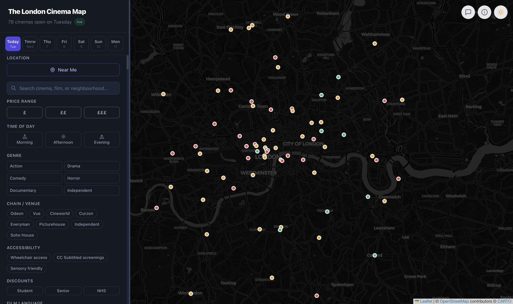
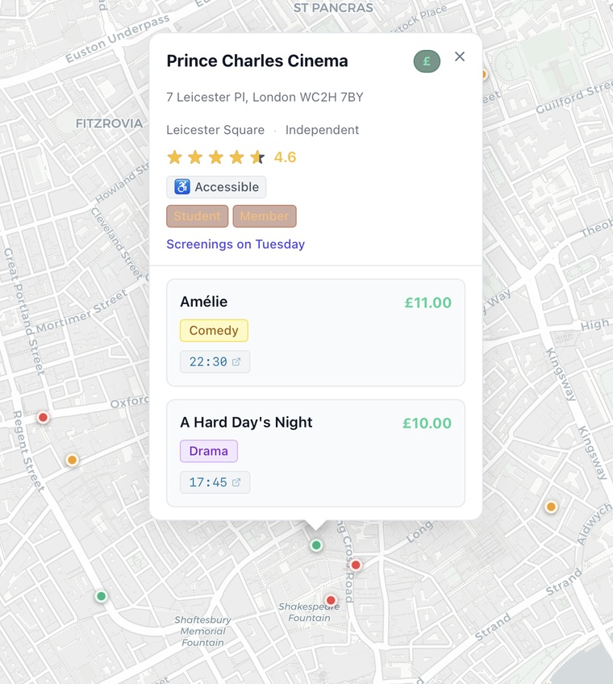

# London Cinema Map

An interactive map of London's cinemas — 81 venues across the majors (Odeon, Vue, Cineworld,
Picturehouse, Curzon, Everyman, BFI) and the city's independents — with live showtimes pulled
from the [MovieGlu](https://developer.movieglu.com) API.

Built with Next.js (App Router), React Leaflet, and Tailwind CSS. Installable as a PWA.



## Features

- **Map view** of every cinema in the dataset, with pins colour-coded by price band —
  🟢 `£` · 🟠 `££` · 🔴 `£££`
- **Live showtimes** for the selected date, fetched per cinema and cached
- **Date picker** covering today plus the next six days
- **Search** across cinema, film, and neighbourhood names
- **"Near Me"** geolocation to centre the map on you
- **Filters** for price, time of day, genre, chain/venue, accessibility (wheelchair access,
  CC subtitled, sensory friendly), discounts (student, senior, NHS), and film language
- **Deep links to booking pages** for each venue
- **Light and dark themes**
- **Responsive** — a bottom sheet on mobile, a sidebar on desktop
- **Offline-capable** via a service worker precaching the shell
- **Feedback form** that emails submissions over SMTP

Selecting a cinema opens its details — address, chain, rating, accessibility and discount
badges, and the day's screenings with times, prices, and genre, each linking out to booking:

<p align="center">
  
</p>

## Getting started

```bash
git clone https://github.com/snoopdogui/london-cinema-map.git
cd london-cinema-map
npm install
cp .env.example .env.local   # then fill in your own credentials
npm run dev
```

Open http://localhost:3000.

## Environment variables

Copy `.env.example` to `.env.local` and populate it. No credentials are committed to this
repository, and `.env.local` is gitignored.

| Variable | Required | Purpose |
|---|---|---|
| `MOVIEGLU_CLIENT` | yes | MovieGlu client identifier |
| `MOVIEGLU_API_KEY` | yes | MovieGlu API key |
| `MOVIEGLU_AUTH` | yes | MovieGlu `Basic …` authorization header |
| `MOVIEGLU_TERRITORY` | yes | Territory code, e.g. `UK` |
| `FEEDBACK_EMAIL_USER` | no | SMTP username for the feedback form |
| `FEEDBACK_EMAIL_PASS` | no | SMTP app-specific password |

You'll need your own MovieGlu credentials — request them at
[developer.movieglu.com](https://developer.movieglu.com).

### Graceful degradation

If the MovieGlu variables are absent or the API is unreachable (quota exhausted, network
failure), `/api/showtimes` logs the reason and falls back to the static cinema list in
`data/cinemas.js`, tagging the response `source: "mock"`. The map still renders; only
showtimes are unavailable. This means the app runs without any credentials at all — useful
for working on the UI.

## Caching

Showtime responses are cached in memory and on disk under the OS temp directory for six
hours, keyed by date. The disk layer exists so the cache survives dev-server hot reloads and
doesn't burn API quota during development.

## Project structure

```
app/
  api/showtimes/   MovieGlu fetch, normalisation, caching, mock fallback
  api/booking/     purchaseConfirmation redirect to the cinema's booking page
  api/feedback/    SMTP handler for the feedback form
components/        Map, Sidebar, CinemaPopup, MobileBottomSheet, modals
data/cinemas.js    Static cinema dataset (coords, chain, neighbourhood, booking URL)
scripts/           One-off audit and data-maintenance utilities
```

## Scripts

```bash
npm run dev     # development server
npm run build   # production build
npm start       # serve the production build
```

The helpers in `scripts/` (`audit-movieglu.js`, `test-movieglu.js`, `add-booking-urls.js`)
are one-off maintenance tools that read `.env.local` directly and compare the API's cinema
list against the local dataset.
